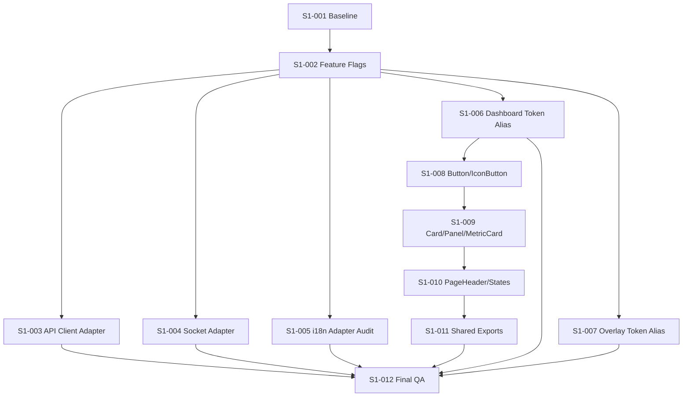

# YORO.gg Sprint1 Dependency Graph

## 1. Task Dependency Graph



## 2. 병렬 가능 그룹

| Group | Tasks | 조건 |
|---|---|---|
| P-A | S1-003, S1-004, S1-005 | S1-002 완료 후 병렬 가능 |
| P-B | S1-006, S1-007 | S1-002 완료 후 병렬 가능 |
| P-C | S1-008, S1-009 | S1-006 완료 후 제한적 병렬 가능. export 충돌 주의 |

## 3. 직렬 처리 필수

| 순서 | 이유 |
|---|---|
| S1-001 → S1-002 | baseline 없이 flag foundation 시작 금지 |
| S1-006 → S1-008 | Button은 token alias 기준 필요 |
| S1-008 → S1-009 → S1-010 | shared UI naming/style 충돌 방지 |
| S1-011 → S1-012 | export/import boundary 확인 후 최종 QA |

## 4. Dependency Detail

| Task | Depends On | Blocks |
|---|---|---|
| S1-001 | 없음 | 모든 Sprint1 task |
| S1-002 | S1-001 | S1-003, S1-004, S1-005, S1-006, S1-007 |
| S1-003 | S1-002 | S1-012 |
| S1-004 | S1-002 | S1-012 |
| S1-005 | S1-002 | S1-012 |
| S1-006 | S1-002 | S1-008, S1-012 |
| S1-007 | S1-002 | S1-012 |
| S1-008 | S1-006 | S1-009 |
| S1-009 | S1-008 | S1-010 |
| S1-010 | S1-009 | S1-011 |
| S1-011 | S1-010 | S1-012 |
| S1-012 | S1-003~S1-011 | Sprint1 close |

## 5. Critical Path

```text
S1-001
  -> S1-002
  -> S1-006
  -> S1-008
  -> S1-009
  -> S1-010
  -> S1-011
  -> S1-012
```

Critical path 예상 합계: 23h

## 6. Merge 순서

1. PR-01 S1-001
2. PR-02 S1-002
3. PR-03 S1-003
4. PR-04 S1-004
5. PR-05 S1-005
6. PR-06 S1-006
7. PR-07 S1-007
8. PR-08 S1-008
9. PR-09 S1-009
10. PR-10 S1-010
11. PR-11 S1-011
12. PR-12 S1-012

병렬 PR도 merge는 dependency 순서를 따른다.

